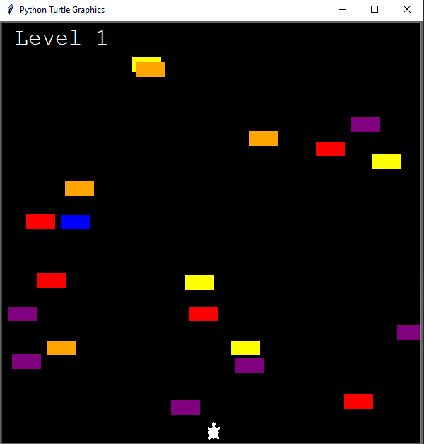
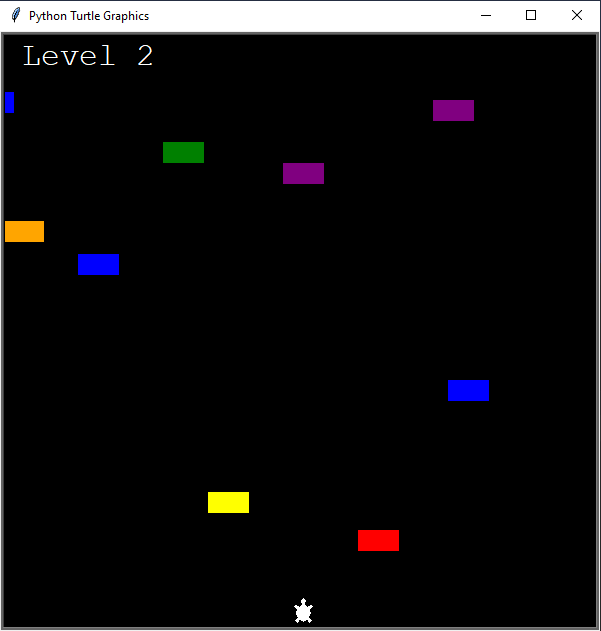
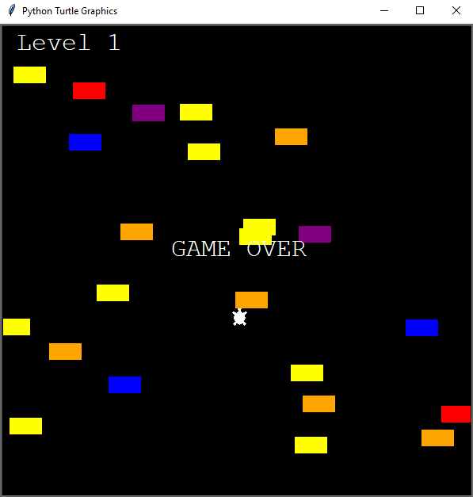

#TurtleCrossingGame

<ol>
    <li>
        Bu oyun, oyuncunun sadece ileri giderek araçlardan sıyrılmaya çalışarak, başlangıç noktasından bitiş noktasına ulaşılmaya çalışıldığı bir oyundur.
    </li>
    <li>
        Bitiş noktasına ulaşıldığı zaman level atlayarak tekrar bitiş noktasına ulaşmaya çalışır.
    </li>
    <li>
        Level alındığında araçların hızı artarak oyun daha da zorlaşır.
    </li>    
    <li>
        Oyuncu bir araca çarptığı zaman oyun biter.
    </li>
</ol>

##Oyun içi görüntüler
 

### Başlangıç

### Level Atlama

### Oyun Sonu

